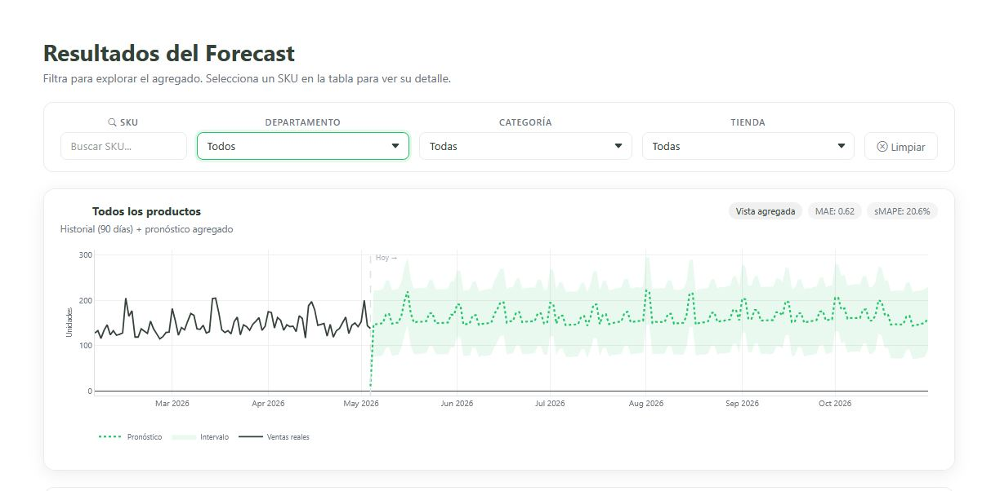
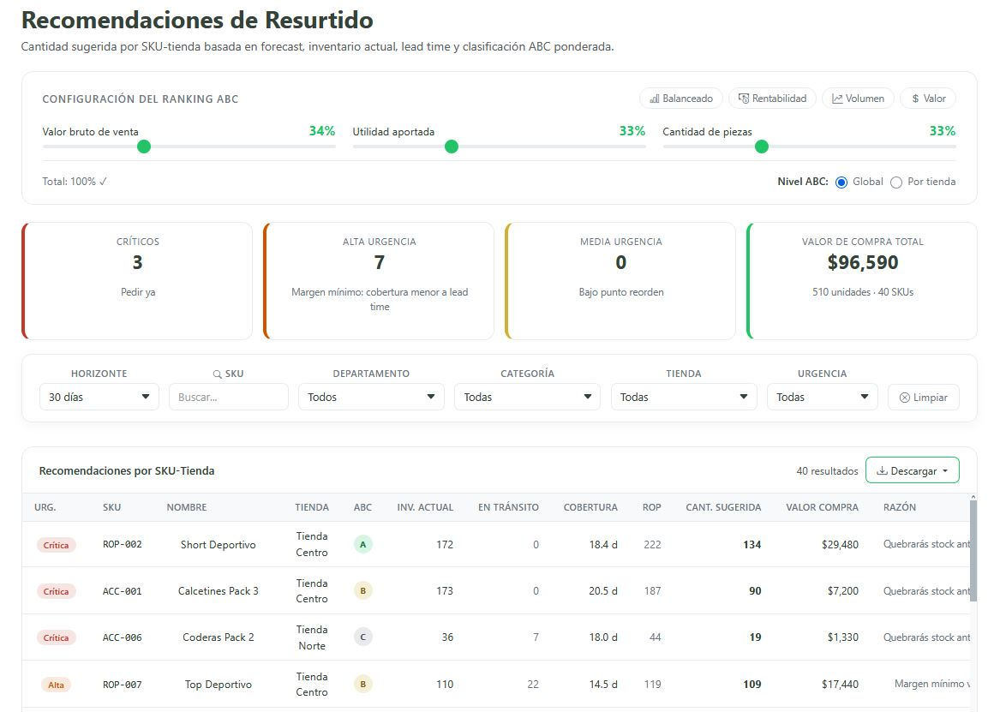
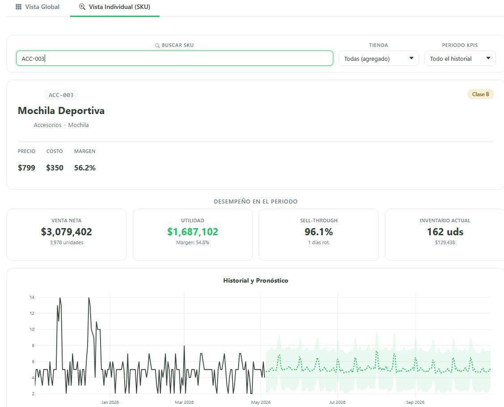
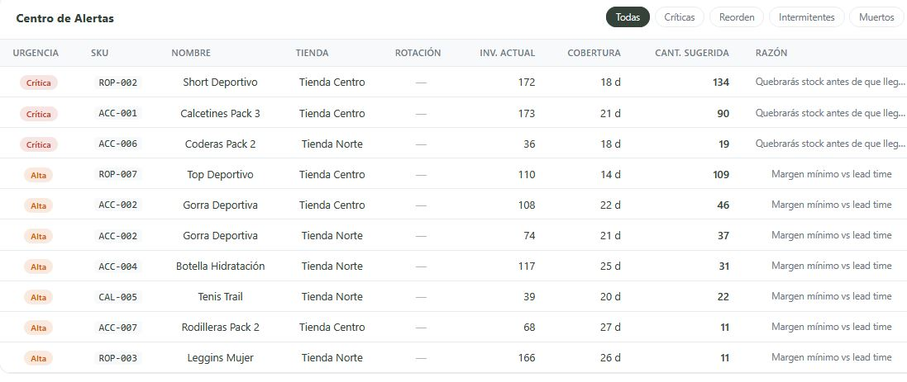
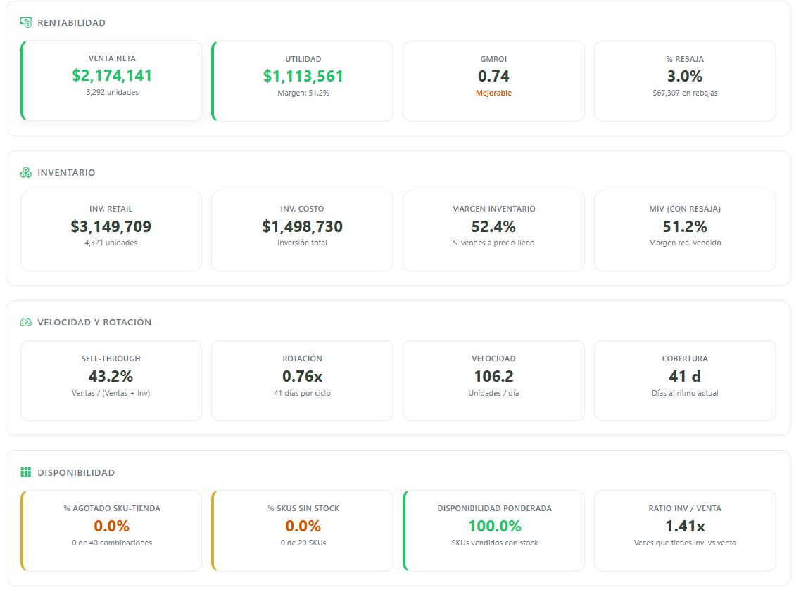

# RetailDashboard — Supply Chain Intelligence Platform
 
Full-stack web application for retail demand forecasting, inventory optimization, and financial KPI analysis. Built with Flask, Prophet + Random Forest ensemble, and a real-time async worker architecture.
 
**[Live App link →](https://retail-dasboard-v2flask-production.up.railway.app/auth/register)**
 
---

## At a Glance

| Metric | Value |
|--------|-------|
| Forecast engine | Prophet + Random Forest ensemble |
| SKU-store combinations | Scales to thousands |
| Training trial time (40 series) | ~35 seconds |
| Replenishment logic | Safety stock with σ from real sales, Z-factor by ABC class |
| ABC classification | Weighted composite score using Normal CDF |
| Deployment | Docker → Railway (PostgreSQL + Redis) |

 
---

## Screenshots
 
<p align="center">
  
</p>
<p align="center"><em>Forecast Results — Aggregated and individual SKU-store view with interactive Plotly chart</em></p>
<p align="center">
  
</p>
<p align="center"><em>Replenishment — Urgency-based recommendations with configurable ABC ranking</em></p>
<p align="center">
  
  
</p>
<p align="center"><em>Dashboard — Global KPIs, forecast summary, restock alerts, and individual SKU deep-dive</em></p>
<p align="center">
  
</p>
<p align="center"><em>Finance — Profitability, inventory health, velocity metrics, and stock availability</em></p>

---

 
## Business Problem
Retail companies struggle with:
    - Poor demand forecasting
    - Overstock and stockouts; Without lead-time-aware reorder points and safety stock calculations, the response is always late.
    - Lack of real-time KPI visibility

  This leads to lost sales and inefficient inventory allocation.
  This application addresses all three by combining ML-based forecasting with inventory optimization logic and real-time financial KPIs in a single platform.

---


## Solution
This application provides:
    - 📊 Automated KPI dashboard (sales, margins, inventory rotation)

    - 📦 Inventory tracking and stock health metrics

    - 📈 Demand forecasting using:
        -> Prophet (trend & seasonality)
        -> Random Forest (feature-driven corrections)

    - 🚛 Replenishment suggestions
    
    - ⚙️ Scalable data pipeline for ingesting retail datasets


## Technical Architecture
 
```
┌─────────────────────────────────────────────────────────┐
│                    RAILWAY (Production)                  │
│                                                         │
│  ┌──────────────────┐     ┌──────────────────┐         │
│  │   Web Service     │     │   Worker Service  │         │
│  │   Flask/Gunicorn  │     │   RQ (Redis Queue)│         │
│  │   2 workers       │     │   Prophet + RF    │         │
│  │   Port 8080       │     │   No public port  │         │
│  └────────┬──────────┘     └────────┬──────────┘         │
│           │                         │                    │
│           └────────┬────────────────┘                    │
│                    │                                     │
│         ┌──────────▼──────────┐                          │
│         │      Redis          │                          │
│         │  Job queue + state  │                          │
│         └─────────────────────┘                          │
│                                                         │
│         ┌─────────────────────┐                          │
│         │    PostgreSQL        │                          │
│         │  All persistent data │                          │
│         └─────────────────────┘                          │
│                                                         │
└─────────────────────────────────────────────────────────┘
 
┌─────────────────────────────────────────────────────────┐
│                  LOCAL DEVELOPMENT                       │
│  Same codebase, env-var fallbacks:                       │
│  SQLite (no DATABASE_URL) + Redis localhost              │
└─────────────────────────────────────────────────────────┘
```

### Why This Architecture
 
- **Async worker** — Prophet + RF training takes 30–60 seconds per run. Running this synchronously would block the web server and timeout. Redis Queue decouples the training job, provides progress tracking, and allows the frontend to poll status via API.
- **Multi-tenant isolation** — Every database query filters by `user_id`. Users only see their own data, products, and forecasts.
- **Environment parity** — The same `config.py` serves both local development (SQLite + localhost Redis) and production (PostgreSQL + managed Redis) through environment variable fallbacks.
---

## Tech Stack
 
| Layer | Technology |
|-------|-----------|
| Backend | Flask 3.1, SQLAlchemy 2.0, Flask-Login, Flask-WTF (CSRF), Flask-Migrate |
| ML/Forecasting | Prophet 1.3, scikit-learn (RandomForest), pandas, NumPy, SciPy |
| Task Queue | Redis + RQ (Redis Queue) |
| Database | PostgreSQL (production), SQLite (local dev) |
| Frontend | HTML5, JavaScript (vanilla), Bootstrap 5, Plotly.js |
| Deployment | Docker, Gunicorn, Railway |
| Data Ingestion | Multi-format ETL (CSV, Excel, JSON) with synonym-based column normalization |
 
---


## Data Pipeline
 
```
Upload file (CSV/Excel/JSON)
    │
    ▼
Column normalization ─── synonym dictionary maps
    │                    "sku", "codigo", "material" → sku_code
    ▼                    "fecha", "date", "timestamp" → date
Schema validation ────── required columns per file type
    │
    ▼
Type coercion ────────── dates (auto-detect DD/MM/YYYY, YYYY-MM-DD, etc.)
    │                    numerics with NaN detection
    ▼
Business rules ───────── no negative prices, SKU upsert for referential integrity
    │
    ▼
Daily aggregation ────── ticket-level → daily SKU-store granularity
    │
    ▼
Bulk insert ──────────── SQLAlchemy bulk_insert_mappings
```
 
---

## About
 
Built by a supply chain professional with experience in demand planning, replenishment, and inventory management across Mexican retail (department stores, footwear, convenience). This project represents the intersection of domain expertise and applied technical capability — every formula, threshold, and business rule comes from real operational experience.
 
The application is designed as a working tool for a PYME retail businesses and simultaneously serves as a technical portfolio demonstrating end-to-end ML engineering applied to supply chain problems.
 
---
 
## License
 
All rights reserved. This code is not licensed for reuse, distribution, or commercial use.
